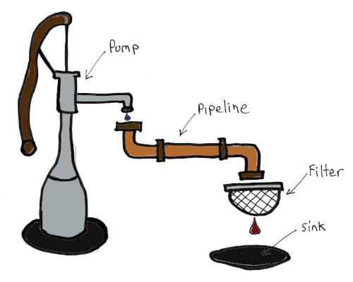

# Pipelines

Pipelines offer a simple abstraction on top of the streaming capabilities of Redis, allowing for data to be streamed 
from one client to another with minimal configuration or effort.

The pipeline API supports numerous operations:

| Operation | Usage                                                  |
|-----------|--------------------------------------------------------|
| Filter    | Exclude items not matching a predicate                 |
| Transform | Transform an item into a different form                |
| Sink      | Do something with the item (e.g. save to a data store) |
| Forward   | Send data to another stream (by namespace)             |

## Basic usage

### Receiver

```cs

var pipeNamespace = "Stream1";
var pipe = client.CreatePipeline<char>(PipelineOptions.FromStartOfStream(pipeNamespace));

var receiverPipe = pipe
    .Filter(x => x.Data != '\n')
    .Transform(x => char.ToUpper(x))
    .Sink(Console.Write);

await receiverTask.Start();

```

### Sender

```cs

var pipeNamespace = "Stream1";
var pipe = client.CreatePipeline<char>(PipelineOptions.FromNow(pipeNamespace));

while (!cancel.IsCancellationRequested)
{
    var k = Console.ReadKey();

    await pipe.PushAsync(k.KeyChar, cancellation: cancel.Token); // Push to the stream
}

```

